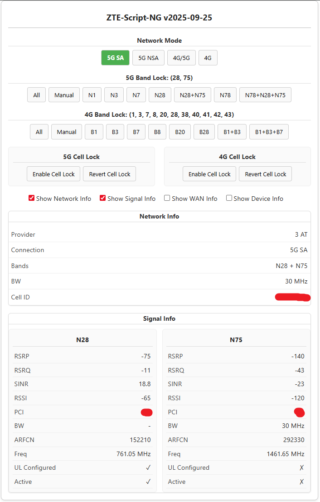

# ZTE-Script

Depending on the device you own, you must choose the correct version of the script.  
Since the internal API of the routers changed, the versions are **not compatible** with each other.

## NG

**Compatible Routers:** ZTE G5TC and later.
This script is a total rewrite.

## Legacy

Compatible Routers: ZTE MC7010, MC888, MC889, and many others.

**WARNING:**

If you are using one of these routers, turn off automatic firmware updates.  
Future updates (such as B19 for the MC889) will make this script unusable.  
Band locking will no longer be possible, as ZTE has broken the locking API in the firmware.

---

See https://www.lteforum.at/mobilfunk/script-fuer-zte-router.20462 for more details.
